# Sơ Đồ Luồng Xử Lý Các Chức Năng MailGuard AI

Cập nhật: 18/06/2026

Tài liệu này mô tả luồng xử lý của các chức năng chính trong hệ thống MailGuard AI. Các sơ đồ được viết bằng Mermaid, có thể xem bằng Markdown Preview của VS Code, GitHub hoặc các công cụ hỗ trợ Mermaid.

## 1. Tổng Quan Kiến Trúc Xử Lý

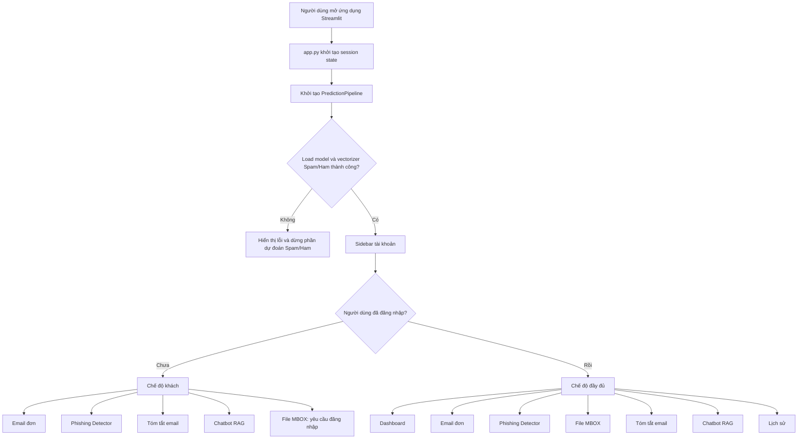

Giải thích:

- `app.py` là điểm vào của ứng dụng Streamlit.
- `PredictionPipeline` load spam classifier và vectorizer theo cấu hình trong `src/config/config.py`.
- `Config` ưu tiên artifact mới nhất trong `outputs/` nếu có đủ model/vectorizer; nếu không có thì fallback về `data/models/v1/`.
- Chế độ khách vẫn dùng được Email đơn, Phishing Detector, Tóm tắt và Chatbot.
- Sau khi đăng nhập, người dùng có thêm Dashboard, xử lý File MBOX, Lịch sử và Feedback.

## 2. Đăng Ký Tài Khoản

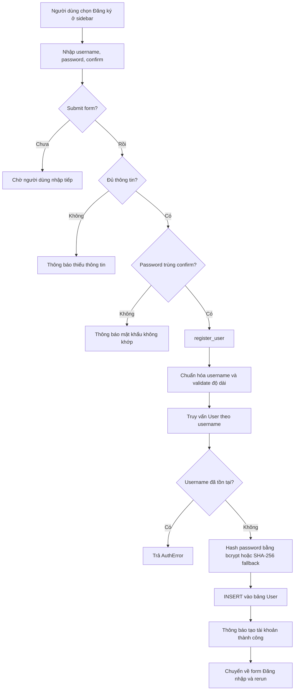

Giải thích:

- UI đăng ký nằm trong sidebar của `app.py`.
- Logic nghiệp vụ nằm trong `src/features/auth/service.py`.
- Password được băm bằng `bcrypt` nếu thư viện khả dụng; nếu không có `bcrypt`, code fallback sang SHA-256 cho môi trường phát triển.
- Tài khoản được lưu vào bảng `User` trong MySQL.

## 3. Đăng Nhập / Đăng Xuất

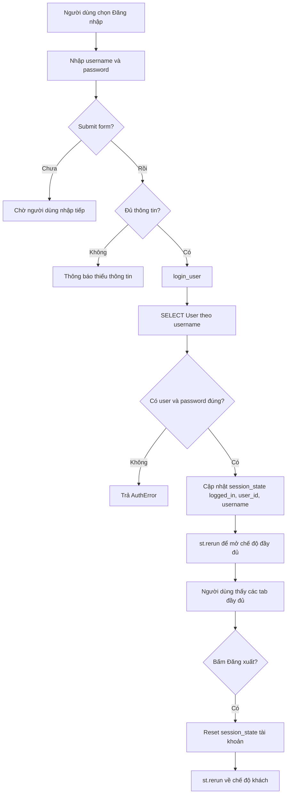

Giải thích:

- `login_user` lấy password hash từ database và gọi `_verify_password`.
- Khi đăng nhập thành công, trạng thái được giữ trong `st.session_state`.
- Khi đăng xuất, các biến `logged_in`, `user_id`, `username`, `last_prediction_id` được reset.

## 4. Kiểm Tra Email Đơn Spam/Ham

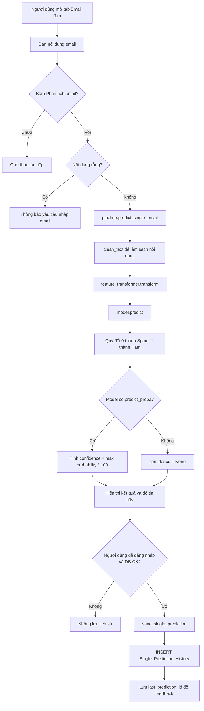

Giải thích:

- Chức năng này dùng `PredictionPipeline.predict_single_email`.
- Feature pipeline được load từ `Config.feature_path`, model được load từ `Config.model_path`.
- Nếu người dùng đăng nhập và database kết nối được, kết quả được lưu vào `Single_Prediction_History`.
- Chế độ khách chỉ hiển thị kết quả, không lưu lịch sử.

## 5. Gửi Feedback Cho Kết Quả Dự Đoán

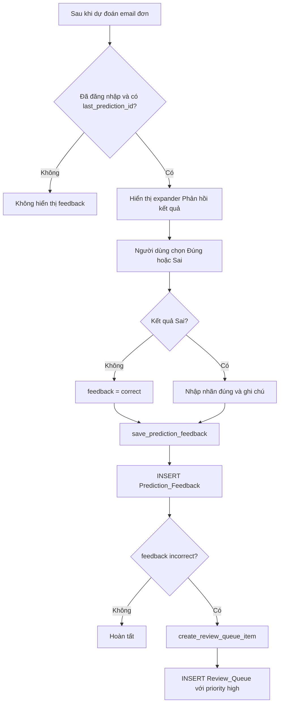

Giải thích:

- Feedback chỉ xuất hiện sau khi có bản ghi dự đoán được lưu.
- Nếu người dùng đánh dấu kết quả sai, hệ thống tạo thêm item trong `Review_Queue`.
- Review Queue được dashboard hiển thị để phục vụ kiểm tra và cải thiện model.

## 6. Xử Lý File MBOX Theo Lô

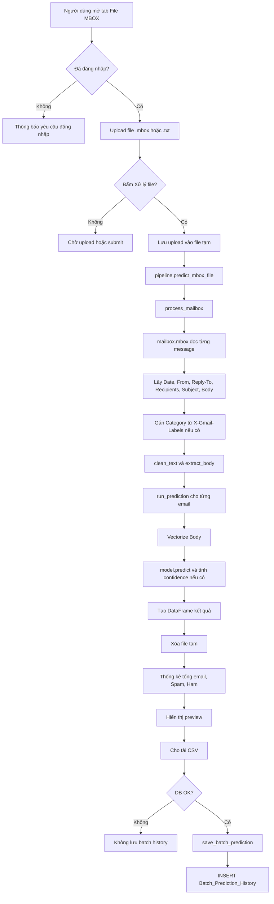

Giải thích:

- Chức năng MBOX bắt buộc đăng nhập.
- File upload được ghi ra file tạm rồi đọc bằng `mailbox.mbox`.
- Mỗi email được trích metadata và body, sau đó chạy cùng model Spam/Ham.
- Kết quả đầy đủ được xuất CSV; database chỉ lưu thống kê batch.

## 7. Xem Lịch Sử Phân Tích

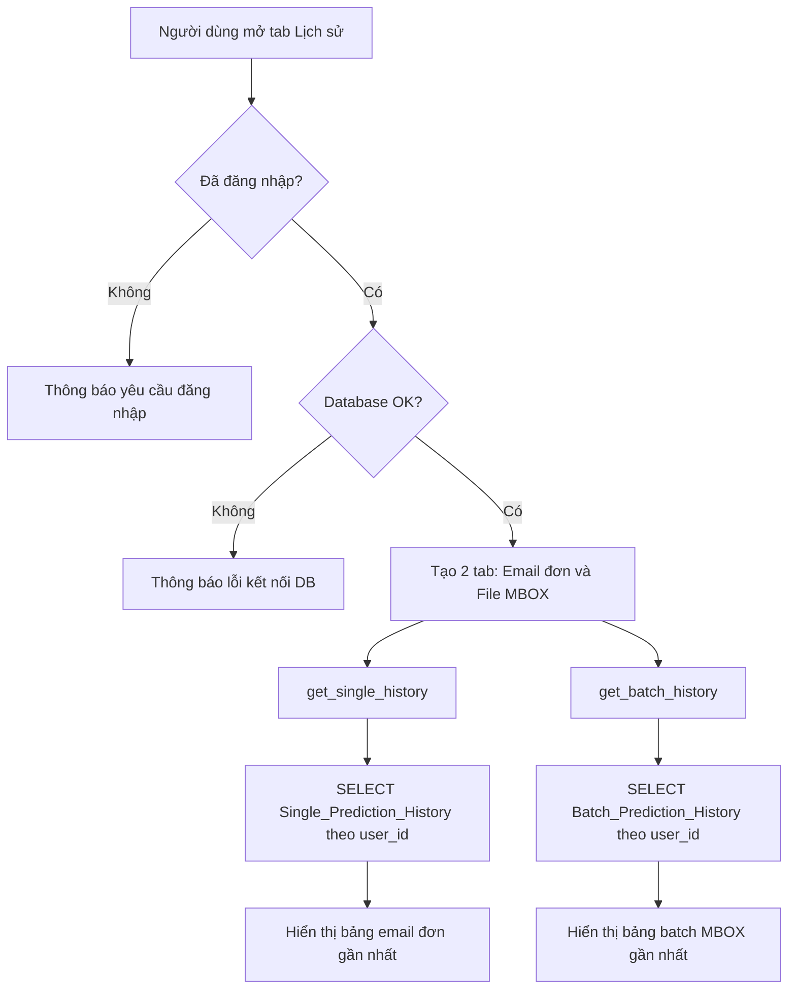

Giải thích:

- Lịch sử chỉ khả dụng khi người dùng đăng nhập và MySQL kết nối được.
- Lịch sử email đơn có preview nội dung và confidence.
- Lịch sử MBOX lưu thống kê batch, không lưu toàn bộ từng email trong file upload.

## 8. Dashboard Bảo Mật

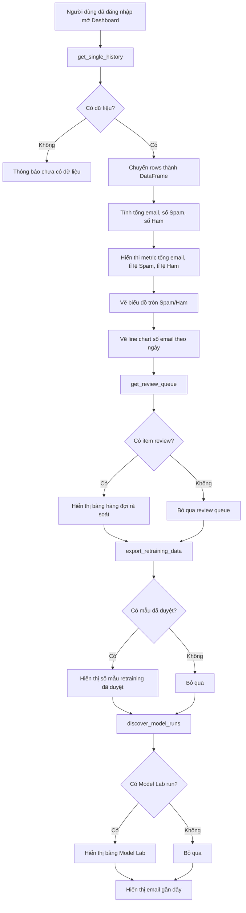

Giải thích:

- Dashboard tổng hợp dữ liệu từ lịch sử dự đoán của người dùng.
- Biểu đồ tròn cho thấy tỉ lệ Spam/Ham, line chart cho thấy số email theo thời gian.
- Dashboard cũng hiển thị `Review_Queue` và các run Model Lab nếu có artifact trong `outputs/*/observations/model_lab_metadata.json`.

## 9. Phishing Detector Cho Email/Text

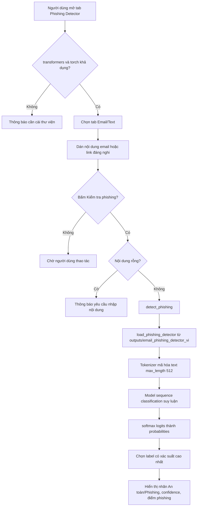

Giải thích:

- Model phishing local được load một lần bằng `st.cache_resource`.
- Input được tokenize và cắt ở 512 token.
- Kết quả gồm label, confidence và xác suất theo từng nhãn (`benign`, `phishing`).
- Chức năng này không ghi database trong luồng hiện tại.

## 10. Phishing Detector Cho Ảnh QR

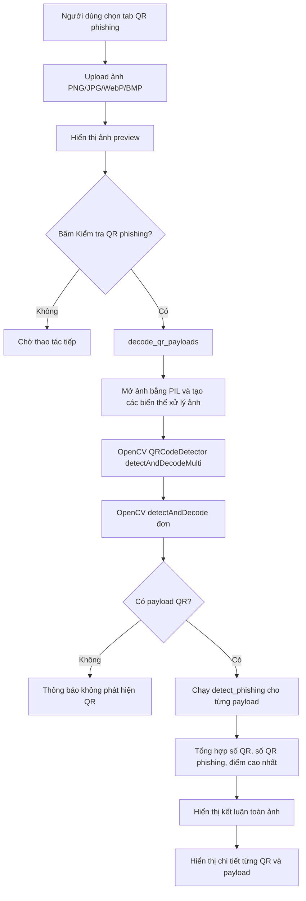

Giải thích:

- Ảnh QR được tiền xử lý theo nhiều biến thể: ảnh gốc, ảnh phóng to, grayscale, tăng contrast, sharpen, crop và binary mask cho QR cách điệu.
- Mỗi payload đọc được từ QR được đưa qua cùng model phishing text.
- Nếu ít nhất một payload bị gán nhãn phishing, UI cảnh báo ảnh QR có dấu hiệu phishing.

## 11. Tóm Tắt Email Bằng Local AI

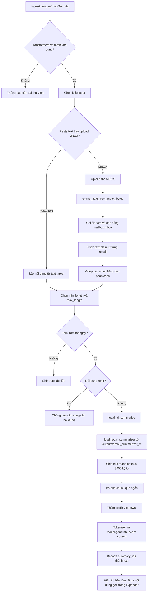

Giải thích:

- Chức năng tóm tắt chạy model Seq2Seq local trong `outputs/email_summarizer_vi`.
- Nếu input là MBOX, hệ thống chỉ trích các phần `text/plain`.
- Văn bản dài được chia thành nhiều chunk để phù hợp giới hạn token của model.
- Mỗi chunk được sinh tóm tắt riêng, sau đó ghép thành kết quả cuối.

## 12. Chatbot RAG Trên File MBOX

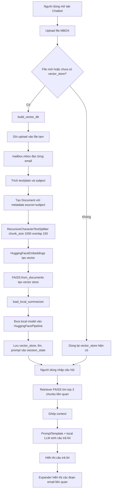

Giải thích:

- Chatbot RAG không train model mới.
- Lập chỉ mục: email được tách thành `Document`, chia chunk, vector hóa bằng `sentence-transformers/all-MiniLM-L6-v2` và lưu vào FAISS.
- Hỏi đáp: câu hỏi được dùng để truy vấn FAISS, lấy 3 đoạn liên quan làm context, sau đó local LLM sinh câu trả lời.
- Local LLM hiện lấy từ `outputs/email_summarizer_vi` qua hàm `load_local_summarizer`.
- Vector store và lịch sử chat được giữ trong `st.session_state`.

## 13. Huấn Luyện Lại Spam Classifier

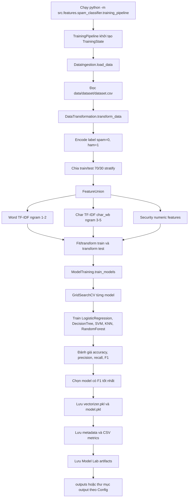

Giải thích:

- Pipeline huấn luyện đọc dataset mặc định từ `data/dataset/dataset.csv`.
- Feature vector gồm word TF-IDF, char n-gram TF-IDF và các dấu hiệu số về bảo mật như độ dài, số chữ số, số URL, từ khóa khẩn cấp, credential, payment và file nguy hiểm.
- Hệ thống train nhiều model bằng `GridSearchCV`, đánh giá trên tập test và chọn model có F1-score tốt nhất.
- Artifact mới được lưu vào thư mục output của lần train; khi app chạy lại, `Config` có thể ưu tiên artifact mới nếu tìm thấy đủ model/vectorizer.

## 14. Model Lab Và Artifact Đánh Giá

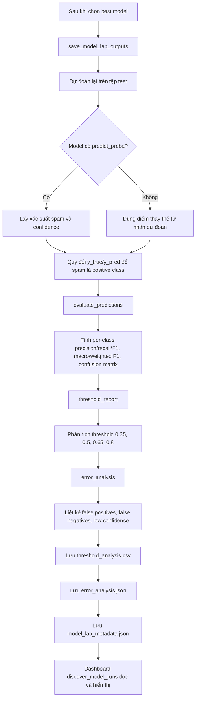

Giải thích:

- Model Lab là phần artifact phục vụ quan sát chất lượng model sau train.
- `threshold_analysis.csv` giúp so sánh trade-off giữa precision/recall ở các ngưỡng.
- `error_analysis.json` giúp xem các mẫu bị dự đoán sai hoặc độ tin cậy thấp.
- Dashboard đọc `model_lab_metadata.json` trong `outputs/*/observations/` để hiển thị các lần train.

## 15. Luồng Kết Nối Database Dùng Chung

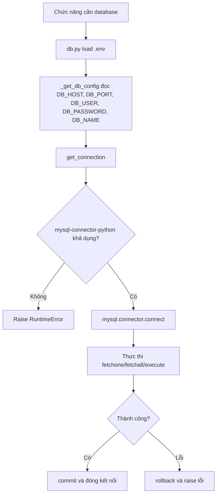

Giải thích:

- Database adapter nằm trong `src/infrastructure/database/db.py`.
- `fetchone`, `fetchall`, `execute` là các helper dùng chung cho auth, lịch sử, dashboard, feedback và batch history.
- `ping()` được app dùng để kiểm tra database trước khi hiển thị các thao tác cần DB.

## 16. Bảng Tổng Hợp Chức Năng Và Nơi Lưu Trữ

| Chức năng | Input chính | Xử lý chính | Output | Lưu trữ |
| --- | --- | --- | --- | --- |
| Đăng ký | Username, password | Validate, hash password, insert user | Tài khoản mới | `User` |
| Đăng nhập | Username, password | Verify password hash | Session đăng nhập | `st.session_state` |
| Email đơn | Nội dung email | Clean text, vectorize, model predict | Spam/Ham, confidence | `Single_Prediction_History` nếu đăng nhập |
| Feedback | Prediction ID, đúng/sai, nhãn sửa | Insert feedback, tạo review item nếu sai | Trạng thái feedback | `Prediction_Feedback`, `Review_Queue` |
| File MBOX | File `.mbox`/`.txt` | Parse mailbox, predict từng email | Bảng kết quả, CSV | `Batch_Prediction_History` |
| Lịch sử | User ID | Query lịch sử email/batch | Bảng lịch sử | MySQL |
| Dashboard | Lịch sử user | Tổng hợp metric, chart, review queue, model runs | Báo cáo trên UI | MySQL + `outputs/` |
| Phishing email/text | Email/link/text | Tokenize, classifier phishing | An toàn/Phishing | Không lưu trong luồng hiện tại |
| Phishing QR | Ảnh QR | Decode QR, classify payload | Kết luận QR phishing | Không lưu trong luồng hiện tại |
| Tóm tắt email | Text hoặc MBOX | Trích text, chunk, local Seq2Seq generate | Bản tóm tắt | Không lưu trong luồng hiện tại |
| Chatbot RAG | MBOX và câu hỏi | Chunk, embedding, FAISS retrieval, local LLM answer | Câu trả lời và context | `st.session_state` |
| Train spam classifier | Dataset CSV | Transform, train nhiều model, chọn best | Model, vectorizer, metrics | `outputs/` hoặc output dir theo `Config` |
